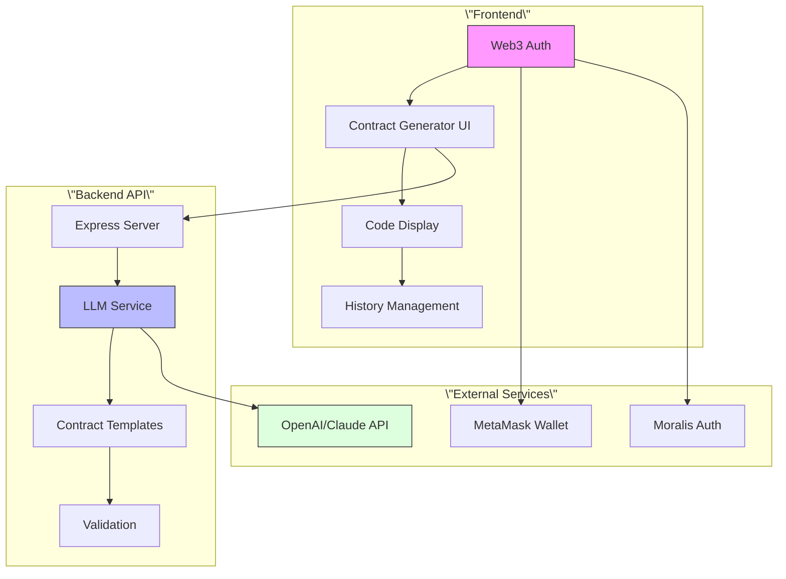

# 🤖 Intelligent Contract - LLM-Powered Smart Contract Generator

A sophisticated Web3 application that uses Large Language Models (GPT-4/Claude) to generate production-ready smart contracts based on natural language requirements.

## 🌟 Features

### 🎯 Core Capabilities
- **AI-Powered Generation**: Uses OpenAI GPT-4 or Anthropic Claude for intelligent contract creation
- **Multi-Contract Support**: ERC-20, ERC-721, MultiSig, DeFi, DAO, and custom contracts
- **Web3 Authentication**: Secure MetaMask integration with challenge-response authentication
- **Real-time Generation**: Streaming responses with loading states and progress indicators
- **Production-Ready Code**: Generated contracts follow OpenZeppelin standards and best practices
- **Vercel Deployment**: Optimized for serverless deployment on Vercel platform

### 🛡️ Security & Quality
- **Security-First**: Generated contracts include reentrancy guards, access controls, and proper validation
- **Gas Optimization**: AI-optimized code for minimal gas consumption
- **Comprehensive Documentation**: Full NatSpec documentation in generated contracts
- **Error Handling**: Robust error handling with detailed user feedback
- **Rate Limiting**: API protection against abuse and excessive usage

## 🏗️ Architecture

### Frontend (Vite + Vanilla JS)
- **Modern Build System**: Vite for fast development and optimized production builds
- **Web3 Integration**: ethers.js for MetaMask interaction and blockchain communication
- **Component Architecture**: Modular JavaScript with clear separation of concerns
- **Responsive Design**: Mobile-first design with adaptive layouts

### Backend (Node.js + Express)
- **Serverless-Ready**: Designed for Vercel Functions with automatic scaling
- **LLM Integration**: Dual support for OpenAI and Anthropic APIs
- **RESTful API**: Clean REST endpoints with comprehensive validation
- **Error Handling**: Structured error responses with detailed logging



## 🚀 Quick Start

### Prerequisites
- Node.js 18+
- OpenAI API key OR Anthropic API key
- MetaMask browser extension
- Vercel account (for deployment)

### 1. Clone and Setup
```bash
git clone https://github.com/your-repo/intelligent-contract.git
cd intelligent-contract
```

### 2. Frontend Setup
```bash
# Install frontend dependencies
npm install

# Copy environment template
cp .env.example .env

# Edit .env with your configuration
# VITE_BACKEND_API_URL=http://localhost:3001/api
# VITE_MORALIS_API_KEY=your-moralis-key
```

### 3. Backend Setup
```bash
cd backend

# Install backend dependencies
npm install

# Copy environment template
cp .env.example .env

# Edit .env with your LLM API key
# LLM_PROVIDER=openai
# OPENAI_API_KEY=your-openai-key
```

### 4. Development
```bash
# Terminal 1: Start backend
cd backend
npm run dev

# Terminal 2: Start frontend
npm run dev
```

Visit http://localhost:3000 to access the application.

## 🌐 Deployment

### Frontend Deployment (Vercel)
```bash
# Build and deploy frontend
npm run build
vercel

# Set environment variables in Vercel dashboard:
# VITE_BACKEND_API_URL=https://your-backend.vercel.app/api
# VITE_MORALIS_API_KEY=your-production-moralis-key
```

### Backend Deployment (Vercel)
```bash
cd backend

# Deploy backend
vercel

# Set environment variables:
# NODE_ENV=production
# LLM_PROVIDER=openai
# OPENAI_API_KEY=your-production-openai-key
# FRONTEND_URL=https://your-frontend.vercel.app
```

## 🔧 Configuration

### LLM Provider Configuration

#### OpenAI (Recommended)
```env
LLM_PROVIDER=openai
OPENAI_API_KEY=sk-your-openai-key
OPENAI_MODEL=gpt-4-turbo-preview
OPENAI_MAX_TOKENS=4000
OPENAI_TEMPERATURE=0.7
```

#### Anthropic Claude
```env
LLM_PROVIDER=anthropic
ANTHROPIC_API_KEY=sk-ant-your-key
ANTHROPIC_MODEL=claude-3-sonnet-20240229
ANTHROPIC_MAX_TOKENS=4000
ANTHROPIC_TEMPERATURE=0.7
```

### Web3 Configuration
```env
VITE_WEB3_DOMAIN=your-domain.com
VITE_WEB3_URI=https://your-app.vercel.app
VITE_WEB3_CHAIN_ID=1
VITE_MORALIS_API_KEY=your-moralis-key
```

## 📊 API Reference

### Generate Contract
```http
POST /api/contracts/generate
Content-Type: application/json

{
  \"requirements\": \"Create an ERC-20 token for a gaming platform\",
  \"contractType\": \"erc20\",
  \"options\": {
    \"tokenName\": \"GameToken\",
    \"tokenSymbol\": \"GAME\",
    \"initialSupply\": \"1000000\"
  }
}
```

### Response
```json
{
  \"success\": true,
  \"data\": {
    \"contract\": \"// SPDX-License-Identifier: MIT\\npragma solidity ^0.8.19;\\n...\",
    \"contractType\": \"erc20\",
    \"metadata\": {
      \"generatedAt\": \"2024-01-01T00:00:00.000Z\",
      \"llmProvider\": \"openai\",
      \"version\": \"1.0.0\"
    }
  }
}
```

## 🎨 Supported Contract Types

| Contract Type | Description | Example Use Cases |
|---------------|-------------|-------------------|
| **ERC-20** | Fungible tokens | Utility tokens, Payment systems, Rewards |
| **ERC-721** | Non-fungible tokens | Digital art, Collectibles, Certificates |
| **MultiSig** | Multi-signature wallets | Team treasury, Secure storage |
| **Crowdfunding** | Fundraising contracts | ICO, Project funding, Donations |
| **DeFi** | DeFi protocols | Lending, Staking, Yield farming |
| **DAO** | Governance contracts | Voting, Proposals, Democracy |
| **Custom** | Tailored solutions | Specific business logic |

## 🛠️ Development

### Project Structure
```
intelligent-contract/
├── src/                    # Frontend source
│   ├── js/                # JavaScript modules
│   ├── css/               # Stylesheets
│   └── index.html         # Main HTML
├── backend/               # Node.js backend
│   ├── controllers/       # Request handlers
│   ├── services/          # Business logic
│   ├── middleware/        # Express middleware
│   └── routes/           # API routes
├── package.json          # Frontend dependencies
└── vercel.json           # Deployment config
```

### Adding New Contract Types
1. Update `contractTemplateService.js` with new type definition
2. Add type-specific prompts and keywords
3. Update frontend contract type detection
4. Test generation with various requirements

### Customizing LLM Prompts
Edit `services/contractTemplateService.js`:
```javascript
getTypeSpecificPrompt(contractType) {
  const prompts = {
    yourNewType: `SPECIFIC REQUIREMENTS FOR YOUR TYPE:
    - Implement specific functionality
    - Add required security measures
    - Include proper documentation`
  };
  return prompts[contractType] || prompts.custom;
}
```

## 🔒 Security Considerations

### API Security
- Rate limiting (100 requests per 15 minutes)
- Input validation and sanitization
- CORS protection
- Environment variable protection

### Generated Contract Security
- OpenZeppelin standard compliance
- Reentrancy protection
- Access control implementation
- Input validation in contracts
- Gas optimization patterns

### Authentication Security
- Challenge-response authentication
- Signature verification
- Session management
- MetaMask integration

## 📈 Performance Optimization

### Frontend Optimization
- Code splitting with dynamic imports
- Lazy loading of components
- Efficient state management
- Optimized bundle size

### Backend Optimization
- Connection pooling
- Request caching
- Compression middleware
- Serverless function optimization

### LLM Optimization
- Prompt engineering for efficiency
- Token limit optimization
- Retry logic with exponential backoff
- Provider failover support

## 🧪 Testing

### Frontend Testing
```bash
npm run test
```

### Backend Testing
```bash
cd backend
npm run test
```

### Integration Testing
```bash
npm run test:integration
```

## 📚 Resources

### Documentation
- [OpenZeppelin Contracts](https://docs.openzeppelin.com/contracts/)
- [Solidity Documentation](https://docs.soliditylang.org/)
- [OpenAI API Reference](https://platform.openai.com/docs/api-reference)
- [Anthropic Claude API](https://docs.anthropic.com/claude/reference/)

### Community
- [GitHub Issues](https://github.com/your-repo/intelligent-contract/issues)
- [Discord Community](#)
- [Documentation Wiki](#)

## 🤝 Contributing

1. Fork the repository
2. Create your feature branch (`git checkout -b feature/amazing-feature`)
3. Commit your changes (`git commit -m 'Add amazing feature'`)
4. Push to the branch (`git push origin feature/amazing-feature`)
5. Open a Pull Request

## 📄 License

This project is licensed under the MIT License - see the [LICENSE](LICENSE) file for details.

## 🙏 Acknowledgments

- **OpenZeppelin** for secure smart contract standards
- **OpenAI** for powerful language model capabilities
- **Anthropic** for Claude AI integration
- **Vercel** for excellent deployment platform
- **MetaMask** for Web3 wallet integration
- **Moralis** for Web3 authentication infrastructure

---

**Built with ❤️ for the Web3 Developer Community**

*Empowering developers to create secure, efficient smart contracts through the power of AI*